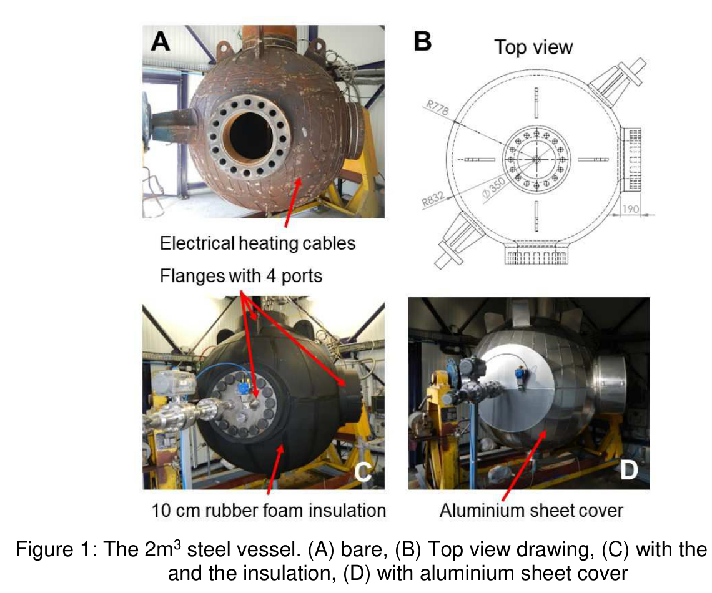
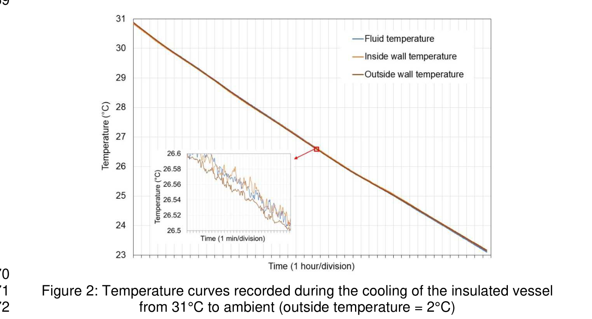
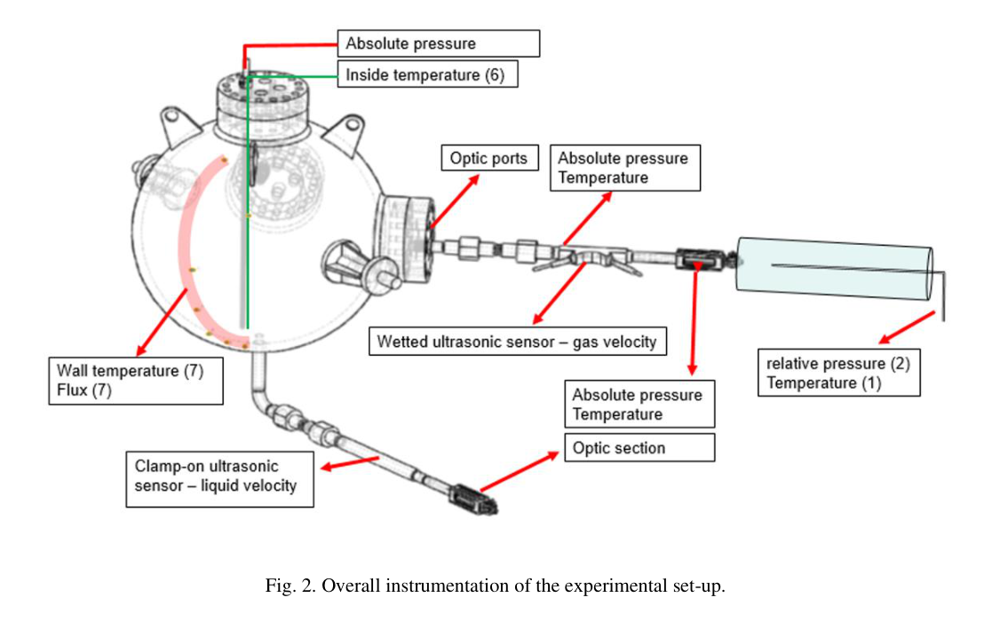
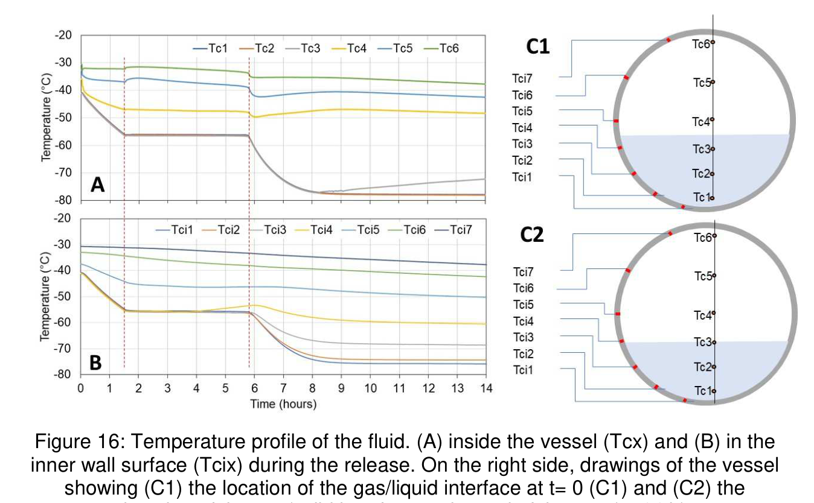
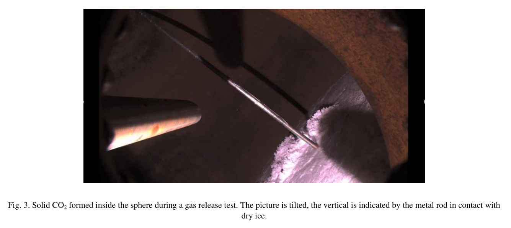
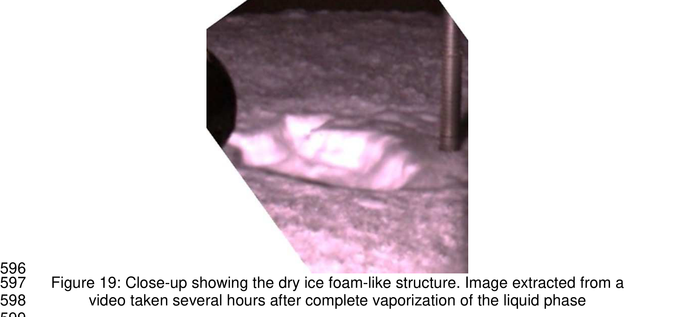
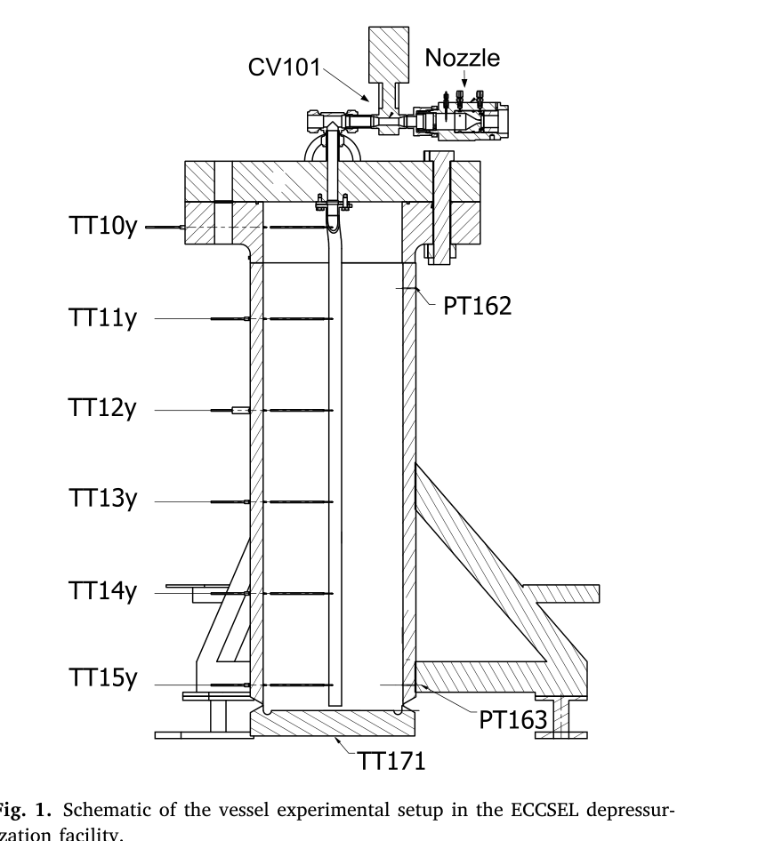
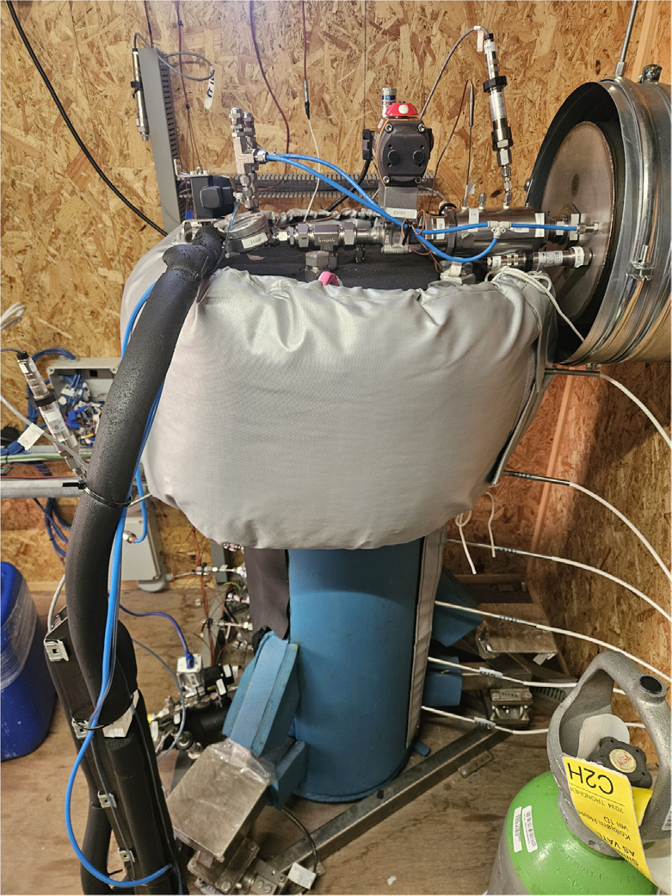
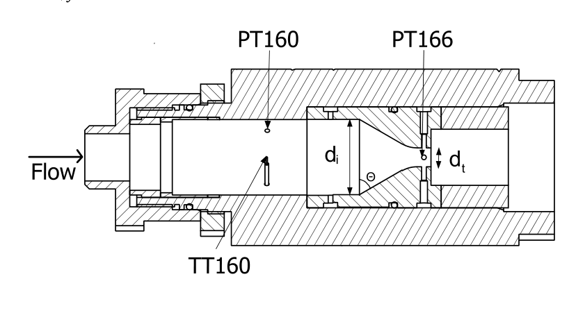

.. _experimental:

============================
Experimental Basis
============================

The add-on is validated against **two independent** CO\ :sub:`2` blowdown campaigns that
together span the pressure range of interest:

* **CARDICE** (Ineris, 2 m\ :sup:`3` sphere) - low/medium pressure (10-20 bar), saturated
  two-phase, both gas- and liquid-space releases; the source of the in-vessel dry-ice
  physics.
* **Høydalsvik/Munkejord** (SINTEF/NTNU, 0.06 m\ :sup:`3` vertical cylinder) - high pressure
  (120 bar), dense-phase, both no-riser (gas-space) and riser (liquid-draw) releases; a
  finely instrumented cross-check of the discharge, dry-ice and stratification behaviour.

CARDICE (Ineris 2 m\ :sup:`3` sphere)
=====================================

The **CARDICE** (CARbon Dioxide ICE) Joint Industry Project, in which Ineris performed
pilot-scale CO\ :sub:`2` blowdown experiments in a 2 m\ :sup:`3` sphere. Two papers
document the work: the GHGT-15 paper :cite:`Vaillant2021`, which gives the test matrix and
the Vessfire comparison, and the IJGGC setup paper :cite:`Jamois2023`, which documents the
rig, instrumentation and calibration in detail. The open 1 Hz dataset is on Zenodo
:cite:`CardiceData2024`.

The vessel
==========

   The 2 m\ :sup:`3` steel sphere: (A) bare, (B) top-view drawing, (C) with flanges
   and insulation, (D) with the aluminium cover.

   From :cite:`Jamois2023`.

The vessel characteristics reported by :cite:`Jamois2023` are summarised in
:numref:`tbl-vessel`.

.. _tbl-vessel:

.. list-table:: Vessel characteristics
   :widths: 45 55
   :header-rows: 1

   * - Property
     - Value
   * - Geometry
     - sphere, two welded hemispheres
   * - Internal volume
     - 2.030 :math:`\pm` 0.005 m\ :sup:`3` (geometric)
   * - Inner radius / diameter
     - 778 mm / 1556 mm
   * - Mean wall thickness
     - 54 :math:`\pm` 5 mm
   * - Total vessel mass
     - 4.80 t (steel shell :math:`\approx` 4 t + 3 flanges)
   * - Steel grade
     - P355GH (1.0473)
   * - Heat capacity :math:`c_p`
     - 450 J/(kg\ :math:`\cdot`\ K)
   * - Thermal conductivity :math:`\lambda`
     - 44 W/(m\ :math:`\cdot`\ K)
   * - Density
     - 7800 kg/m\ :sup:`3`
   * - Design
     - 200 bara / :math:`-60\,^{\circ}`\ C

In HydDown the sphere is modelled as two hemispherical heads with zero cylinder
length (``vessel.type: Hemispherical``, ``length: 0``, ``diameter: 1.58``). The wall
thickness is set to 0.072 m rather than the physical 54 mm so that the
shell-corrected wall mass matches the measured 4.80 t total (the extra accounts for
the three heavy flanges/nozzles, which HydDown does not model separately).

Insulation and external heat transfer
=====================================

The sphere is insulated with 10 cm of rubber foam
(:math:`\lambda_\text{fo} = 0.034` W/(m\ :math:`\cdot`\ K)) over an outer area of
11 m\ :sup:`2`. :cite:`Jamois2023` reports the external heat transfer in two ways:

**Theoretical (steady conduction through the foam):**

.. math::
   :label: hext-theo

   h_\text{theo} = \frac{\lambda_\text{fo}\,A_\text{out}}{L_\text{fo}}
   = \frac{0.034 \times 11}{0.10} = 3.75\ \text{W/K}

**Measured (a cooling calorimetry test, their Fig. 2):** the insulated vessel was
warmed and allowed to cool towards the 2 :math:`^{\circ}`\ C ambient. The contents
dropped :math:`\Delta T = 8\,^{\circ}`\ C over :math:`\Delta t = 45` h. The heat-loss
rate is inferred from the vessel thermal mass :math:`C` (dominated by the 4 t of
steel, :math:`4000 \times 450 = 1.8` MJ/K, giving :math:`\approx 89` W; :math:`\approx 107`
W including the contents):

.. math::
   :label: hext-meas

   \dot{Q} = C\,\frac{\Delta T}{\Delta t} \approx 107\ \text{W},
   \qquad
   h = \frac{\dot{Q}}{\overline{\Delta T}} = \frac{107}{25} = 4.3\ \text{W/K}

where :math:`\overline{\Delta T} \approx 25\,^{\circ}`\ C is the mean inside-outside gap
over the run. Note that this ``h`` is a **whole-vessel conductance in W/K**, not a
per-area coefficient; per unit outer area it is
:math:`4.3 / 11 = 0.39` W/(m\ :sup:`2`\ :math:`\cdot`\ K), which is the value used as
``heat_transfer.h_outer`` in the models. The measured 4.3 W/K exceeds the pure-foam
3.75 W/K by :math:`\approx 15\,\%` because the real heat paths also include the flanges,
the release pipe, and the thermocouple wells (8 mm :math:`\times` 250 mm pipes
protruding through the insulation) - thermal bridges the conduction estimate ignores.

   Cooling curves of the insulated vessel used to obtain the measured external
   heat-transfer conductance.

   From :cite:`Jamois2023`.

For the several-hour CO\ :sub:`2` blowdowns this :math:`\sim 100` W ingress is small
against the latent (flashing/sublimation) loads, so the blowdown is effectively
near-adiabatic.

Instrumentation
===============

   Overall instrumentation of the set-up.

   From :cite:`Vaillant2021`.

The measured quantities are:

* absolute **pressure** inside the sphere and in the release pipe;
* **fluid temperature** at 6 heights inside the sphere (``Tc in 1..6``) and in the pipe;
* inner and outer **wall temperature** at 7 heights (``Tc1..Tc7`` / ``Tc F1..F7``);
* **mass flow rate** through the release pipe;
* the **mass of the vessel** (fluid + solids) via 4 load cells (Mettler-Toledo
  0745A, 2200 kg each, :math:`\pm` 100 g; total-mass uncertainty :math:`\pm` 0.4 t on
  4 t; flow-rate uncertainty :math:`\pm` 5 %).

   Example measured temperatures during a blowdown: (A) fluid at 6 heights inside the
   vessel and (B) the wall 5 mm from the inner face, showing the stable vertical
   stratification of the vapour phase.

   From :cite:`Jamois2023`.

Two independent flow measurements were used: direct **weighing** (load cells) and an
**ultrasonic** velocity (inline on the gas pipe, clamp-on on the liquid pipe) combined
with the computed density. The load-cell mass, corroborated against the measured
temperature and pressure, is the reference used here for the initial inventory and
the discharge-rate calibration. A camera and a katharometer were also fitted.

The release pipe is 40 mm inner diameter, :math:`\sim` 2 m long, terminated by a
**calibrated orifice** connected to the vessel middle (vapour release) or bottom
(liquid release). The paper gives one pure-CO\ :sub:`2` orifice example of **4 mm**
(range 1 mm to full bore); per-test sizes are not reported, so they are inferred here
from the measured discharge (:ref:`discharge`).

Test matrix
===========

The pure-CO\ :sub:`2` tests are 5-10; tests 1-4 are methane / methane-CO\ :sub:`2`
mixtures and are out of scope. For the low-temperature tests the sphere was filled
with liquid to about the middle. The matrix is reported by :cite:`Vaillant2021`.

.. list-table:: CARDICE pure-CO\ :sub:`2` test matrix
   :widths: 12 22 18 18 15 15
   :header-rows: 1

   * - Test
     - Composition
     - :math:`P_0` [bar]
     - :math:`T_0` [\ :math:`^{\circ}`\ C]
     - Release
     - HydDown file
   * - 5
     - 100 % CO\ :sub:`2`
     - 20
     - :math:`-20`
     - Gas
     - ``CARDICE_test5.yml``
   * - 6
     - 100 % CO\ :sub:`2`
     - 20
     - :math:`-20`
     - Liquid
     - ``CARDICE_batch6.yml``
   * - 7
     - 100 % CO\ :sub:`2`
     - 15
     - :math:`-29`
     - Gas
     - ``CARDICE_test7.yml``
   * - 8
     - 100 % CO\ :sub:`2`
     - 15
     - :math:`-29`
     - Liquid
     - ``CARDICE_test8.yml``
   * - 9
     - 100 % CO\ :sub:`2`
     - 10
     - :math:`-40`
     - Gas
     - ``CARDICE_test9.yml``
   * - 10
     - 100 % CO\ :sub:`2`
     - 10
     - :math:`-40`
     - Liquid
     - ``CARDICE_test10.yml``

Gas releases produced large in-vessel dry-ice banks (over 450 kg reported), as in
:numref:`fig-dryice`; liquid releases produced essentially none inside the vessel.

.. _fig-dryice:

   Solid CO\ :sub:`2` formed inside the sphere during a **gas** release test (the
   picture is tilted; the metal rod indicates the vertical).

   From :cite:`Vaillant2021`.

   Close-up of the dry-ice "foam-like" structure (floating solid with vapour
   bubbles).

   From :cite:`Jamois2023`.

Raw-data alignment
==================

The 1 Hz files include a pre-release period; the true blowdown start :math:`t_0` is
detected from the onset of the inventory-mass decline (and the pressure drop) and
all comparisons are time-shifted to it (e.g. :math:`t_0 = 438` s for cardice-06).
Folder ``cardice-0N`` corresponds to test :math:`N`.

Høydalsvik/Munkejord (SINTEF dense-phase cylinder)
==================================================

The second campaign is the SINTEF/NTNU dense-phase depressurization experiments
:cite:`Hoydalsvik2026`, which release CO\ :sub:`2` from a small, heavily instrumented
vertical cylinder at :math:`\sim` 120 bar. Relative to CARDICE it probes a very different
part of the envelope - **dense-phase (sub-cooled) start, high pressure, thick relative
wall** - and its dense fluid flashes hard through the nozzle, so it stresses the discharge
and flash-boiling models rather than the multi-hour in-vessel dry-ice bank. The open
dataset is on Zenodo (record 19589510, CC BY 4.0).

The vessel
----------

   Schematic of the vessel experimental setup in the ECCSEL depressurization facility: the
   cylindrical vessel with the removable riser tube, the six fluid/wall thermocouple heights
   (TT10y-TT15y), the vessel pressure sensors PT162 (top) / PT163 (bottom), the bottom
   outer-wall sensor TT171, and the nozzle with valve CV101 on the lid.

   From :cite:`Hoydalsvik2026`.

   Picture of the insulated vessel in the ECCSEL depressurization facility.

   From :cite:`Hoydalsvik2026`.

The vessel is a SS316 cylinder with an inner diameter of 273.0 mm and an internal height
of 1000 mm, a 25.4 mm wall and a 50 mm bottom plate, closed by an 80 mm lid (580 mm
diameter) on an 83 mm flange and standing on three legs. Its design pressure is 138 bar. It
is insulated with 50 mm Armaflex LTD (walls/bottom) and a 45 mm inflatable lid cover.

.. list-table:: SINTEF vessel characteristics (from Høydalsvik et al.)
   :widths: 45 55
   :header-rows: 1

   * - Property
     - Value
   * - Geometry
     - vertical circular cylinder, three legs
   * - Inner diameter / internal height
     - 273.0 mm / 1000 mm
   * - Internal volume
     - :math:`\approx` 0.058 m\ :sup:`3`
   * - Wall / bottom / lid thickness
     - 25.4 / 50 / 80 mm
   * - Steel grade (:math:`\rho`, :math:`k`, :math:`c_p`)
     - SS316 (7950 kg/m\ :sup:`3`, 16.3 W/m/K, 500 J/kg/K)
   * - Design pressure
     - 138 bar
   * - Insulation
     - 50 mm Armaflex LTD + 45 mm lid cover
   * - Wall-to-bore ratio :math:`t/D`
     - :math:`\approx` 0.093 (vs :math:`\approx` 0.046 for the CARDICE sphere)

In HydDown the cylinder is modelled as ``vessel.type: Flat-end``, ``orientation:
vertical``, ``length: 1.0``, ``diameter: 0.273``, ``thickness: 0.0254``. The thicker
*relative* wall matters below the triple point: it feeds more lateral heat into the
dry-ice-contact wall than the CARDICE geometry (:ref:`validation`).

Release configurations
----------------------

CO\ :sub:`2` is discharged through a converging nozzle in one of two configurations:

* **no-riser (gas-space) release** - the nozzle draws from the top of the vessel; the dense
  liquid stays in the vessel, giving the gas-draw / in-vessel dry-ice behaviour (the
  P1-P3 spine of :ref:`model_map`);
* **riser (liquid-draw) release** - a 20 mm riser tube draws liquid from :math:`\approx`
  9 mm above the floor to the lid centre (set in the model by ``release.discharge_location``),
  so the vessel drains as a liquid release and empties before reaching the triple point.

The CO\ :sub:`2` leaves through valve CV101 and a converging nozzle of throat diameter
**8.0, 6.5 or 4.5 mm** (inlet diameter 32 mm, half-angle :math:`\theta = 60^{\circ}`),
matching the choked-flow orifice/nozzle study :cite:`Hammer2022` on the same facility.

   Schematic of the interchangeable converging nozzle, with the inlet diameter
   :math:`d_i`, throat diameter :math:`d_t` and half-angle :math:`\theta`, and the
   throat pressure sensors PT160 / PT166.

   From :cite:`Hoydalsvik2026`.

Instrumentation
---------------

The vessel is densely instrumented with **26 thermocouples, four Keller PA33Xei pressure
sensors and three scales** (one per leg, for the vessel weight). Fluid and wall temperatures
are measured at **6 heights** (TT10y at 950 mm down to TT15y at 50 mm from the bottom plate)
and, per height, at four radial positions - labelled ``TT1xy`` with ``x`` the height and
``y`` the radial position: ``y = 4`` fluid on the central axis, ``y = 3`` fluid 5.5 mm from
the wall, ``y = 2`` wall 3 mm inside the inner face, ``y = 1`` outer wall. Vessel pressure is
the mean of PT162 (170 mm from the top) and PT163 (50 mm from the bottom); PT160 / PT166
sit just before and at the nozzle throat. Sampling is at 1000 Hz, averaged to 0.5 Hz.

In the validation the fluid and wall temperatures are shown as **upper / lower bands** (the
top three vs the bottom three sensor heights) to bracket the vertical stratification, and
each channel is read on its own time base to avoid a clock mismatch between the pressure,
temperature and weight streams. The blowdown onset is taken from the dense-flash pressure
drop and all traces are shifted to it.

Test matrix
-----------

The nine pure-CO\ :sub:`2` cases used here are:

.. list-table:: Høydalsvik/Munkejord test matrix (as modelled)
   :widths: 14 16 16 16 38
   :header-rows: 1

   * - Test
     - :math:`P_0` [bar]
     - :math:`T_0` [\ :math:`^{\circ}`\ C]
     - Nozzle
     - Configuration
   * - Exp71
     - 122.6
     - 25.2
     - 8.0 mm
     - no-riser (gas)
   * - Exp72
     - 119.0
     - 24.9
     - 6.5 mm
     - no-riser (gas)
   * - Exp75
     - 119.0
     - 25.0
     - 4.5 mm
     - no-riser (gas)
   * - Exp52
     - 119.9
     - 15.4
     - 8.0 mm
     - riser (liquid)
   * - Exp53
     - 119.5
     - 24.4
     - 8.0 mm
     - riser (liquid)
   * - Exp56
     - 119.1
     - 15.2
     - 6.5 mm
     - riser (liquid)
   * - Exp57
     - 116.8
     - 24.5
     - 6.5 mm
     - riser (liquid)
   * - Exp45
     - 119.9
     - 14.5
     - 4.5 mm
     - riser (liquid)
   * - Exp46
     - 116.7
     - 24.4
     - 4.5 mm
     - riser (liquid)
