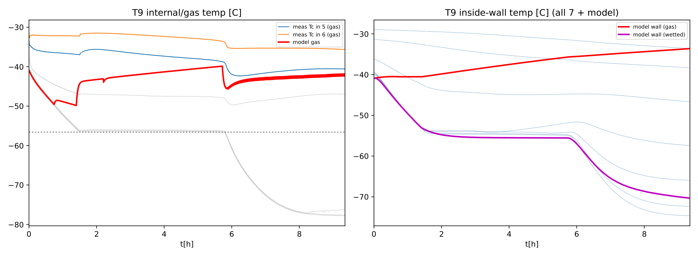

.. _heat_transfer:

============================
Heat and Mass Transfer
============================

The two-phase (non-equilibrium) vessel carries **separate gas and liquid zones** with
their own temperatures, and a **two-node wall** (a gas-contact node and a
liquid/solid-contact "wetted" node). This chapter documents the wall model above and
below the triple point, the natural-convection coefficients, the initialisation, and
the zone mass/energy balances. Implemented in ``hdclass.py`` (with correlations in
``transport.py`` and the below-triple wall in the two-zone steppers).

Two-node wall above the triple point (NEM)
==========================================

Above the triple point the CoolProp non-equilibrium model resolves the wall into an
**unwetted (gas-contact)** node :math:`T_\text{wall}` and a **wetted (liquid-contact)**
node :math:`T_\text{wall}^{w}`, exchanging with the respective fluid zone:

.. math::
   :label: qinner

   \dot{Q}_\text{inner} &= h_\text{in}\,A_\text{unwetted}\,\bigl(T_\text{wall} - T_g\bigr) \\
   \dot{Q}_\text{inner}^{w} &= h_\text{in}^{w}\,A_\text{wetted}\,\bigl(T_\text{wall}^{w} - T_l\bigr)

with the wetted/unwetted areas from the vessel geometry at the current liquid level.
The inner coefficients :math:`h_\text{in}` follow natural-convection correlations
(``h_inner: calc``); the gas side uses the **gas** temperature in the NEM. The external
side uses ``h_outer`` (the Jamois-measured :math:`0.39 \approx 0.4` W/m\ :sup:`2`\ K,
:ref:`experimental`).

Natural convection
==================

The natural-convection HTC uses the Geankoplis :cite:`Geankoplis1993` Nusselt
correlation with the Rayleigh number :math:`\mathrm{Ra} = \mathrm{Gr}\,\mathrm{Pr}`:

.. math::
   :label: nu

   \mathrm{Gr} = \frac{g\,\beta\,|T_\text{wall} - T_\text{fluid}|\,L^3}{\nu^2},
   \qquad
   \mathrm{Nu} =
   \begin{cases}
     0.13\,\mathrm{Ra}^{1/3} & \mathrm{Ra} \ge 10^9 \\
     0.59\,\mathrm{Ra}^{1/4} & 10^4 < \mathrm{Ra} < 10^9 \\
     1.36\,\mathrm{Ra}^{1/5} & \text{otherwise}
   \end{cases}
   \qquad h = \frac{\mathrm{Nu}\,k}{L}

with :math:`L` the vessel diameter and fluid properties (:math:`\beta, \nu, k,
\mathrm{Pr}`) from CoolProp.

Below the triple point (two-zone wall)
======================================

Below the triple point the two-zone model carries the wall as two nodes.

**Gas-contact wall** (:math:`T_\text{wall}`) exchanges with the gas and the ambient
(the liquid/solid zone is adiabatic to it):

.. math::
   :label: gaswall

   m_w c_{p,w}\,\frac{dT_\text{wall}}{dt} = \dot{Q}_\text{out} - \dot{Q}_{wg},
   \quad
   \dot{Q}_{wg} = h_{gw}\,A_g\,\bigl(T_\text{wall} - T_g\bigr),
   \quad
   \dot{Q}_\text{out} = h_\text{out}\,A_\text{out}\,\bigl(T_\text{amb} - T_\text{wall}\bigr)

where :math:`A_g = A_\text{inner}\cdot`\ ``solid_gas_wall_frac``.

**Wetted (solid/liquid-contact) wall** (:math:`T_\text{wall}^{w}`,
``_wetted_wall_step``) relaxes toward the cold phase - the triple point on the plateau,
the sublimation line on the descent - over the wetted wall fraction, using
``solid_h_inner`` as the wall :math:`\leftrightarrow` solid coefficient:

.. math::
   :label: wetwall

   m_w^{w} c_{p,w}\,\frac{dT_\text{wall}^{w}}{dt} = \dot{Q}_\text{out}^{w} - \dot{Q}_{ws},
   \quad
   \dot{Q}_{ws} = h_\text{si}\,A_\text{wet}\,\bigl(T_\text{wall}^{w} - T_\text{cold}\bigr)

**Wetted-wall hand-over.** The wetted node is *seeded at the triple-point hand-over from
the above-triple wetted wall* (which has cooled with the liquid), so the cold
liquid-contact wall keeps tracking the cold phase instead of jumping back to the warm
gas wall. Before this fix the reported wetted wall collapsed to the gas wall at the
triple point (a :math:`\sim` 20 :math:`^{\circ}`\ C jump). The reciprocal wall
:math:`\rightarrow` solid heat is intentionally **not** removed from the (adiabatic)
solid zone, matching the two-zone simplification and leaving the calibrated dry-ice
mass unchanged. With ``solid_h_inner`` :math:`= 150` W/m\ :sup:`2`\ K the wetted wall
reaches :math:`\approx -75\,^{\circ}`\ C (matching the measured bottom sensors); a
sensitivity on test 7 gives :math:`20 \rightarrow -59`, :math:`60 \rightarrow -70`,
:math:`150 \rightarrow -74`, :math:`400 \rightarrow -75.5\,^{\circ}`\ C.

Natural-convection gas-wall HTC ("calc")
========================================

``release.solid_h_gas_wall`` accepts a fixed number or the string ``"calc"``. With
``"calc"`` the below-triple gas :math:`\leftrightarrow` wall coefficient is the same
natural-convection correlation :eq:`nu`, evaluated for CO\ :sub:`2` **vapour** via
CoolProp's ``T|gas`` phase specification - which is valid for the gas root below the
triple point (verified down to :math:`\sim` 1 bar). At plateau conditions it gives
:math:`h_{gw} \approx 11` W/m\ :sup:`2`\ K (vs a fixed 15). It falls back to 15 on any
CoolProp failure or a negligible gas/wall :math:`\Delta T`. Because :math:`\approx 11 <
15`, the calculated value puts slightly *less* heat into the gas, so it does not close
the gas-temperature gap (below) - it isolates that gap as stratification rather than
the wall coefficient.

Gas-liquid interphase
=====================

``calculation.h_gas_liquid`` accepts ``"calc"``/``"calc_two_sided"`` (natural-convection
correlations across the interface) or a fixed number. For a liquid drain a small fixed
value (:math:`\approx 2` W/m\ :sup:`2`\ K) keeps the warm gas decoupled from the cold
boiling liquid (near-adiabatic), reproducing the measured warm gas / cold liquid
split.

Initialisation of the warm gas and split wall
=============================================

Two related initialisation features (both keyed on ``initial.gas_temperature``):

* **Superheated gas zone.** With ``initial.gas_temperature`` the gas zone starts warmer
  than the saturated liquid (a lower density and mass; the fill takes up the difference
  at a matched total mass). The value is set to the **mid-band (median) of the top 3
  gas-space thermocouples** at :math:`t_0` - a representative warm-gas start rather than
  the single warmest sensor.
* **Split wall init.** With a superheated gas zone the wall has equilibrated with the
  phase it touches before the blowdown, so the **gas-contact wall starts at the gas
  temperature** and the **wetted wall at the liquid temperature** (rather than both at
  ``initial.temperature``). An optional ``initial.wall_temperature`` gives a uniform
  override. Starting the gas and gas-wall warm lifts the modelled gas by
  :math:`\sim 0.4`-5 :math:`^{\circ}`\ C toward the measured top, with the wetted wall,
  retained mass and rates unchanged. Default behaviour (no ``gas_temperature``) is
  unchanged.

Zone mass and energy balances (NEM)
===================================

Each zone integrates its own internal energy. The outflow enthalpy is **attributed to
the phase the mass actually leaves from**: a liquid-space release draws liquid, a
vapour-space release / standard blowdown draws gas (exactly one of :math:`h_g^\text{out}`,
:math:`h_l^\text{out}` is non-zero):

.. math::
   :label: nem-energy

   \Delta U_g &= -\,\dot{m}\,h_g^\text{out}\,\Delta t + \dot{Q}_\text{inner}\,\Delta t
                 - \dot{Q}_{gl}\,\Delta t + E_\text{evap} - E_\text{cond} \\
   \Delta U_l &= -\,\dot{m}\,h_l^\text{out}\,\Delta t + \dot{Q}_\text{inner}^{w}\,\Delta t
                 + \dot{Q}_{gl}\,\Delta t - E_\text{evap} + E_\text{cond}

where :math:`\dot{Q}_{gl} = h_{gl}\,A_\text{interface}\,(T_g - T_l)` is the interphase
heat and :math:`E_\text{evap}, E_\text{cond}` are the boil-off / condensation phase-transfer
energies handled in the mass balance. Both wall :math:`\rightarrow` gas
(:math:`\dot{Q}_\text{inner}`) and wall :math:`\rightarrow` liquid
(:math:`\dot{Q}_\text{inner}^{w}`) terms are present, so the wall heats both zones.

The gas-temperature gap (stratification)
========================================

For the **gas** releases the modelled 0-D gas node runs colder than the measured warm
top (e.g. :math:`\sim -49` vs :math:`-27\,^{\circ}`\ C for test 5). The real gas is
**stratified** - warm on top, cold near the interface - which a single 0-D gas node
cannot represent; it averages the two and mixes in cold boil-off vapour. This is a
fundamental 0-D limitation, not a heat-transfer-coefficient error (the wall model
reproduces the measured wall, and the gas-wall HTC is the physical natural-convection
value). Capturing it would need a stratified (multi-node) gas zone. The warm-gas
initialisation above reduces, but does not remove, the gap.

:numref:`fig-t9-heat` shows the mechanism for a gas release: the gas expansion-cools
during the fast blowdown, then **re-warms** during the constant-pressure plateau as the
wall heats the near-isobaric gas, while the two wall nodes separate into a warm
gas-contact wall and a cold wetted (dry-ice-contact) wall.

.. _fig-t9-heat:

   Test 9 gas-release diagnostic: internal/gas temperatures (left) and inner-wall
   sensors vs the two modelled wall nodes (right).
