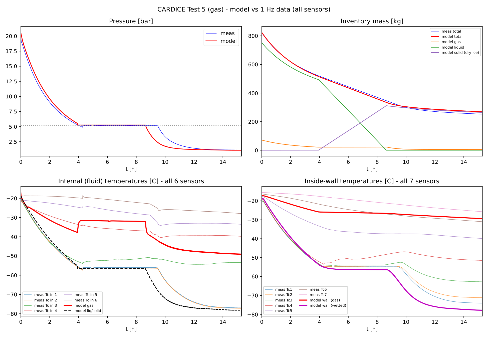
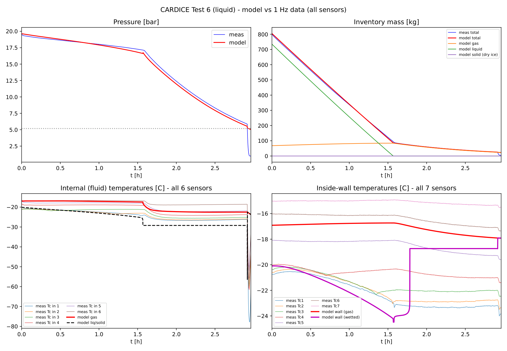
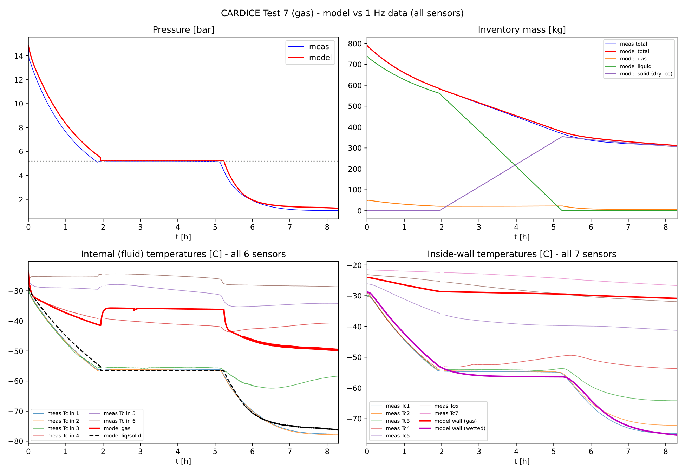
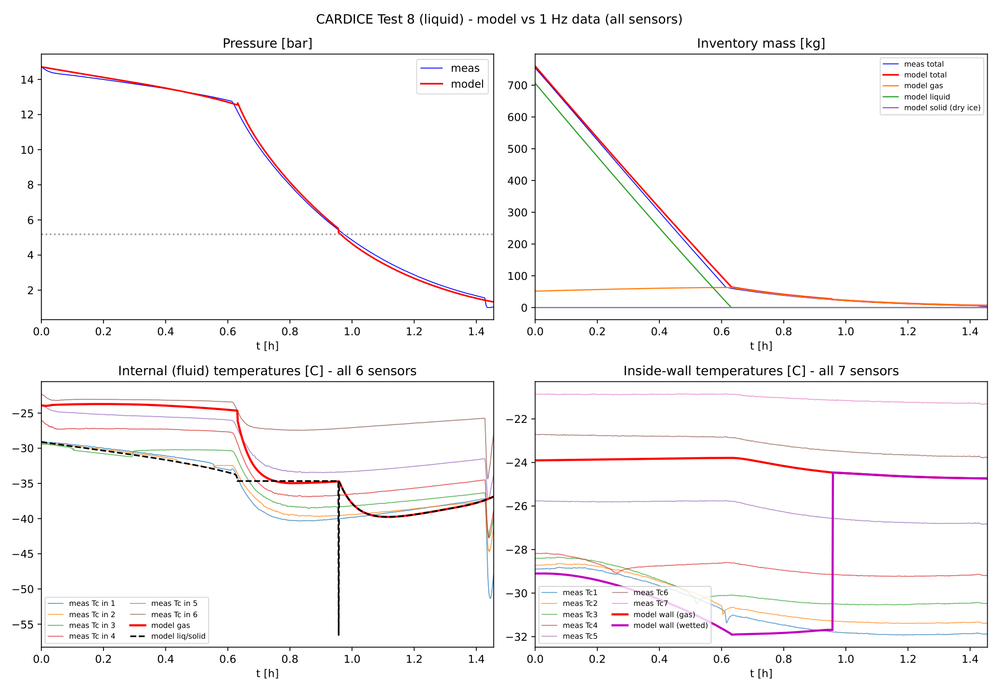
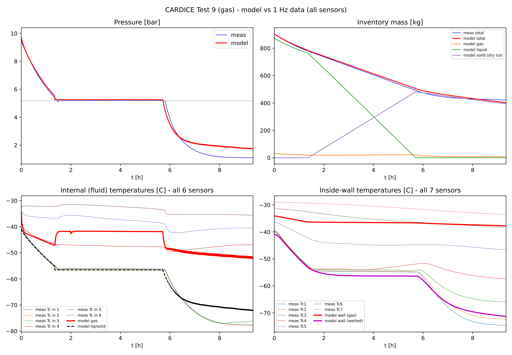
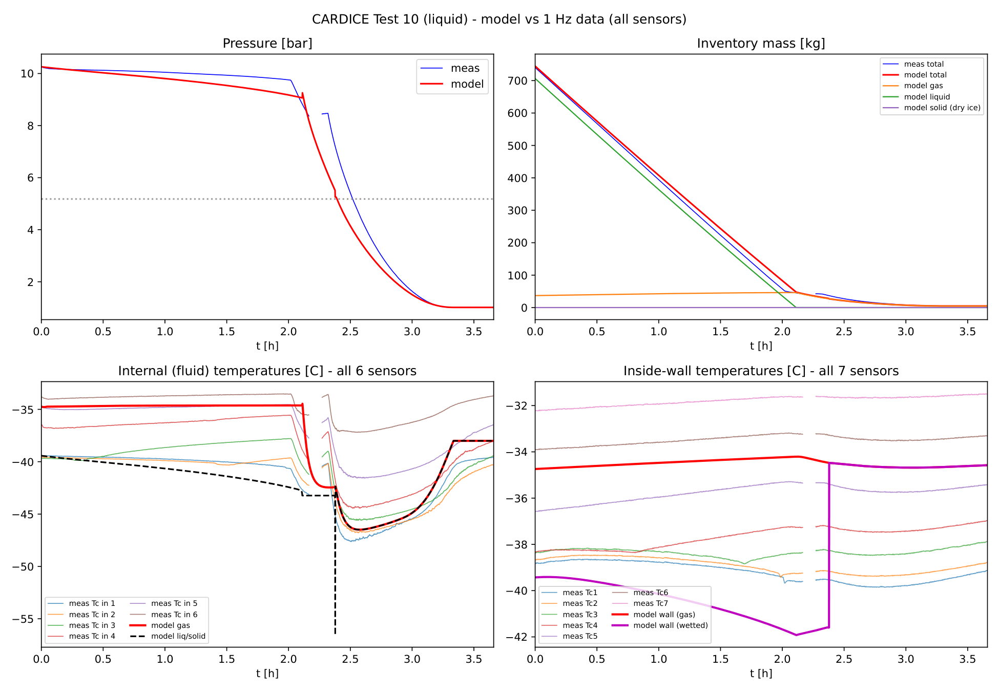
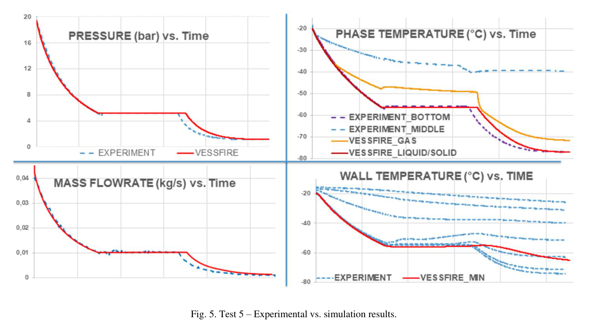
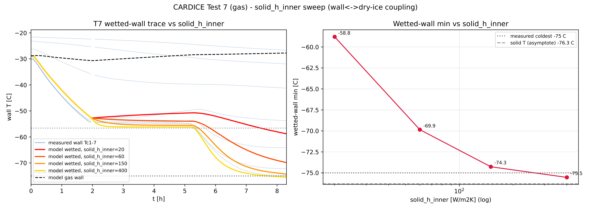

.. _validation:

==========
Validation
==========

The CO\ :sub:`2` add-on is validated against the full pure-CO\ :sub:`2` CARDICE set
(tests 5-10, :ref:`experimental`) using the open 1 Hz Ineris data
:cite:`CardiceData2024,Vaillant2021`. Each case has a tracked input file in
``validation/CARDICE_*.yml`` and a four-panel comparison figure.

Methodology
===========

For every test:

#. **Time base** - the blowdown start :math:`t_0` is detected from the onset of the
   load-cell mass decline (and the pressure drop); all data are shifted to it.
#. **Initial mass** - ``vessel.liquid_level`` is calibrated (via the CoolProp initial
   phase masses) to the measured load-cell inventory. All six match within 0.4 %.
#. **Discharge** - a single physical :math:`C_d = 0.68`; the orifice is inferred from
   the reliable gas discharge and the liquid gets the HNE boost :math:`N`
   (:ref:`discharge`).
#. **Gas start** - ``initial.gas_temperature`` = mid-band of the top 3 gas-space
   thermocouples; the gas-contact wall starts at that temperature and the wetted wall
   at the liquid temperature (:ref:`heat_transfer`).
#. **Heat transfer** - ``h_outer`` = 0.4 W/m\ :sup:`2`\ K (Jamois); below the triple
   point the gas-wall uses ``solid_h_gas_wall: "calc"`` (natural convection) and the
   wetted wall ``solid_h_inner`` = 150 W/m\ :sup:`2`\ K.

Master comparison
=================

.. list-table:: Model vs measured (CARDICE tests 5-10)
   :widths: 8 10 12 20 22 16
   :header-rows: 1

   * - Test
     - Phase
     - :math:`m_0` mdl/meas [kg]
     - Retained dry ice mdl/meas [kg]
     - Wetted (bottom) wall mdl/meas [\ :math:`^{\circ}`\ C]
     - Duration mdl/meas [h]
   * - 5
     - gas
     - 825 / 823
     - 269 / 217
     - :math:`-78` / :math:`-75`
     - 9.8 / 10.9
   * - 6
     - liquid
     - 805 / 802
     - 4.4 / 4.4
     - :math:`-25` / :math:`-24`
     - 2.7 / 2.9
   * - 7
     - gas
     - 790 / 791
     - 312 / 298
     - :math:`-75` / :math:`-75`
     - 6.0 / 5.9
   * - 8
     - liquid
     - 760 / 758
     - 4.6 / 3.7
     - :math:`-32` / :math:`-32`
     - 1.33 / 1.33
   * - 9
     - gas
     - 904 / 904
     - 402 / 412
     - :math:`-71` / :math:`-75`
     - 7.6 / 6.7
   * - 10
     - liquid
     - 745 / 743
     - 4.8 / :math:`\sim 0`
     - :math:`-42` / :math:`-40`
     - 2.9 / 2.9

The central physics is reproduced across the set: **gas releases retain 270-400 kg of
in-vessel dry ice with multi-hour triple-point plateaus and walls to** :math:`-75\,^{\circ}`\ **C**;
**liquid releases retain essentially none, with warm walls** - the dry ice a liquid leak
makes appears downstream instead. Initial mass, discharge rates (single :math:`C_d`),
retained mass and wall temperatures all agree.

Per-test comparisons
====================

Each figure has four panels: vessel pressure; inventory mass (with the modelled gas /
liquid / solid breakdown); all 6 internal fluid thermocouples vs the modelled gas and
liquid/solid temperatures; and all 7 inner-wall thermocouples vs the modelled
gas-contact and wetted wall nodes.

   Test 5 - gas release, 20 bar. Long triple-point plateau, :math:`\sim` 270 kg
   retained dry ice, wetted wall to :math:`-78\,^{\circ}`\ C.

   Test 6 - liquid release, 20 bar. Liquid drains and boils out before the triple
   point; no in-vessel dry ice; pressure and inventory track the data to
   :math:`\sim` 8 bar / 2.5 h.

   Test 7 - gas release, 15 bar.

   Test 8 - liquid release, 15 bar. Single :math:`C_d`: liquid 0.311 vs 0.317, gas
   tail 0.030 vs 0.030 kg/s, duration 1.33 vs 1.33 h.

   Test 9 - gas release, 10 bar. The most retained dry ice (:math:`\sim` 400 kg).

   Test 10 - liquid release, 10 bar. Orifice from the liquid rate (4.09 mm); duration
   2.89 vs 2.92 h.

Benchmark against Vessfire (Test 5)
===================================

Test 5 is the paper's benchmark. :cite:`Vaillant2021` report the measured pressure,
mass flow rate, phase temperatures and wall temperatures against Vessfire
(:numref:`fig-vaillant-t5`). HydDown reproduces the same three-stage behaviour -
gas/liquid blowdown, triple-point plateau, gas/solid sublimation descent - and, like
Vessfire, captures the pressure and rate well while under-predicting the (stratified)
gas temperature.

.. _fig-vaillant-t5:

   Test 5 experimental vs Vessfire results (pressure, mass flow rate, phase
   temperature, wall temperature).

   From :cite:`Vaillant2021`.

Sensitivity: wall-to-solid coefficient
======================================

The wetted (bottom) wall minimum below the triple point is set by ``solid_h_inner``.
A sweep on test 7 shows it approaches the :math:`-76\,^{\circ}`\ C solid asymptote; 150
W/m\ :sup:`2`\ K matches the measured :math:`-75\,^{\circ}`\ C coldest sensor.

   Test 7 wetted-wall temperature and its minimum vs ``solid_h_inner``.

Remaining gaps
==============

These are documented model limitations, not defects:

* **Gas-temperature stratification.** The 0-D gas node runs colder than the measured
  warm top on the gas cases (:math:`\sim -49` vs :math:`-27\,^{\circ}`\ C); a single node
  cannot hold the vertical gradient (:ref:`heat_transfer`). Vessfire, a 0-D-gas tool,
  shows the same :cite:`Vaillant2021`.
* **Triple-point handover kink.** A :math:`\sim 3\,^{\circ}`\ C gas-temperature kink at the
  CoolProp :math:`\rightarrow` thermopack vessel hand-over (liquid cases); small vs the
  stratification gap; deferred.
* **Test 6 abrupt final collapse.** The measured vessel empties abruptly at
  :math:`\sim` 2.9 h - faster than any physical orifice for the residual gas - a
  non-orifice end-effect (blowdown-valve full-open / final venting) that a steady
  discharge model does not reproduce.
* **Gas vs liquid orifice at 10 bar (test 10).** The gas- and liquid-inferred orifices
  differ by :math:`\sim 8` % because the equilibrium HEM liquid over-predicts at 10 bar;
  see the phase-specific-:math:`C_d` note in :ref:`discharge`.

Regression
==========

The base HydDown behaviour is unchanged: all new inputs default off
(``liquid_nonequilibrium: 0``, no ``gas_temperature``, fixed ``solid_h_gas_wall``), and
``test_all.py`` passes except two pre-existing, unrelated failures (a Tk/plotting
environment issue and a modified ``rupture.yml`` example). A dedicated
``src/hyddown/test_co2_release.py`` covers the CO\ :sub:`2` module.
