.. _validation:

==========
Validation
==========

The CO\ :sub:`2` add-on is validated against the pure-CO\ :sub:`2` **CARDICE** set (Ineris,
tests 5-10) and the **Høydalsvik/Munkejord** dense-phase set (SINTEF, 9 cases), both
described in :ref:`experimental`. Each case has a tracked input file and a four-panel
comparison figure; the generators are ``scripts/validate_cardice_reconciled.py`` and
``scripts/validate_munkejord.py``.

CARDICE (Ineris)
================

Methodology
-----------

For every test:

#. **Time base** - the measured trace is time-shifted to the model. A **gas** release
   declines in pressure from the start, so it is anchored at a mid-blowdown **reference
   pressure** (:math:`P` fallen :math:`\sim` 15 % of its span). A **liquid** release barely
   moves the pressure while the liquid drains, so a pressure reference over-shifts it; those
   are anchored on the **inventory-mass decline onset** instead, which keeps the initial
   total inventory aligned. Acquisition gaps in the 1 Hz files (e.g. a 385 s outage in test
   10) are merged and the temperature step across the gap removed.
#. **Initial mass** - ``vessel.liquid_level`` is calibrated (via the CoolProp initial phase
   masses) to the measured load-cell inventory; all six match within 0.4 %.
#. **Discharge** - true 3/4/6 mm orifices :cite:`Drescher2022`, a phase-split :math:`C_d`
   (:math:`C_{d,\text{gas}} = 0.84`, :math:`C_{d,\text{liq}} = 0.62`) and the liquid HNE
   boost :math:`N` (:ref:`discharge`).
#. **Below the triple point** - the gas wall uses ``solid_h_gas_wall: churchill``
   (Churchill-Chu), the plateau wetted wall ``solid_h_inner: cooper`` (Cooper boiling), and
   the descent dry-ice wall tracks the sublimation line (:ref:`heat_transfer`).
#. **Heat transfer** - ``h_outer`` = 0.4 W/m\ :sup:`2`\ K (Jamois).

Master comparison
-----------------

.. list-table:: Model vs measured (CARDICE tests 5-10, current model)
   :widths: 8 10 20 24 24
   :header-rows: 1

   * - Test
     - Phase
     - :math:`m_0` mdl/meas [kg]
     - Retained dry ice mdl/meas [kg]
     - Wetted (bottom) wall min mdl/meas [\ :math:`^{\circ}`\ C]
   * - 5
     - gas
     - 824 / 823
     - 266 / 217
     - :math:`-78` / :math:`-75`
   * - 6
     - liquid
     - 804 / 802
     - 0 / 4.2
     - :math:`-24` / :math:`-24`
   * - 7
     - gas
     - 790 / 791
     - 302 / 298
     - :math:`-76` / :math:`-75`
   * - 8
     - liquid
     - 761 / 758
     - 0 / 3.8
     - :math:`-32` / :math:`-32`
   * - 9
     - gas
     - 904 / 904
     - 392 / 412
     - :math:`-72` / :math:`-75`
   * - 10
     - liquid
     - 745 / 743
     - 0 / 5.1
     - :math:`-42` / :math:`-40`

The central physics is reproduced across the set: **gas releases retain 266-392 kg of
in-vessel dry ice with multi-hour triple-point plateaus and walls to** :math:`-75\,^{\circ}`\ **C**;
**liquid releases retain essentially none, with warm walls** - the dry ice a liquid leak
makes appears downstream instead. Test 7 lands on the measured retained mass; test 5
over-predicts (its 4.8-t wall stores the most sensible heat) and test 9 slightly
under-predicts. The liquid tests empty to a residual gas heel rather than the measured
:math:`\sim` 4-5 kg, a small non-retained end-effect.

Per-test comparisons
--------------------

Each figure has four panels: vessel pressure; inventory mass (with the modelled gas /
liquid / solid breakdown); the internal fluid thermocouples as **two bands** (upper three =
gas, lower three = liquid/solid) vs the modelled gas and liquid/solid temperatures; and the
inner-wall thermocouples as two bands (upper = gas wall, lower = wetted wall) vs the
modelled gas-contact and wetted wall nodes.

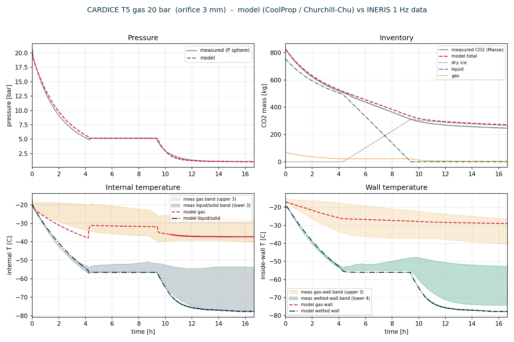

   Test 5 - gas release, 20 bar. Long triple-point plateau, :math:`\sim` 266 kg retained
   dry ice, wetted wall to :math:`-78\,^{\circ}`\ C.

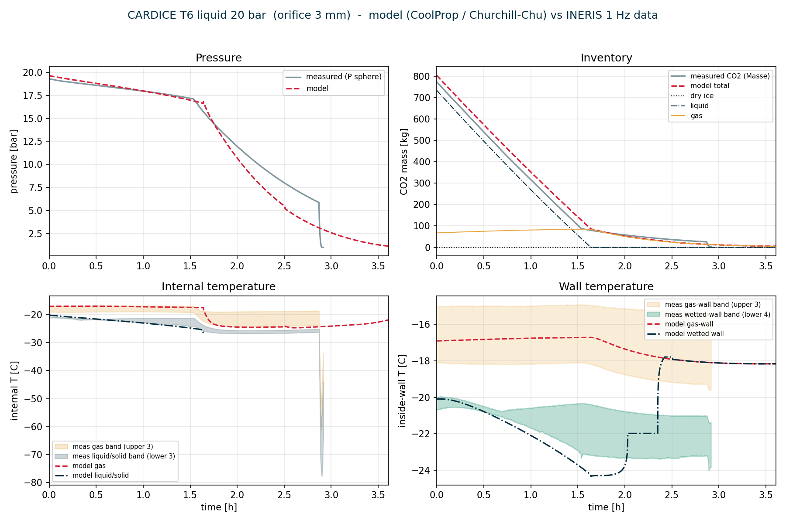

   Test 6 - liquid release, 20 bar. Liquid drains and boils out before the triple point; no
   in-vessel dry ice.

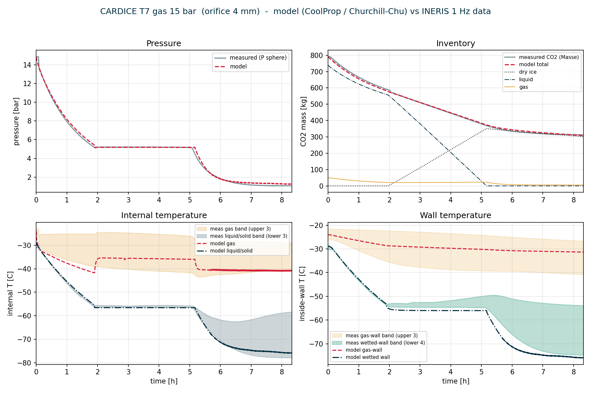

   Test 7 - gas release, 15 bar. Retained dry ice on the measured value (302 vs 298 kg).

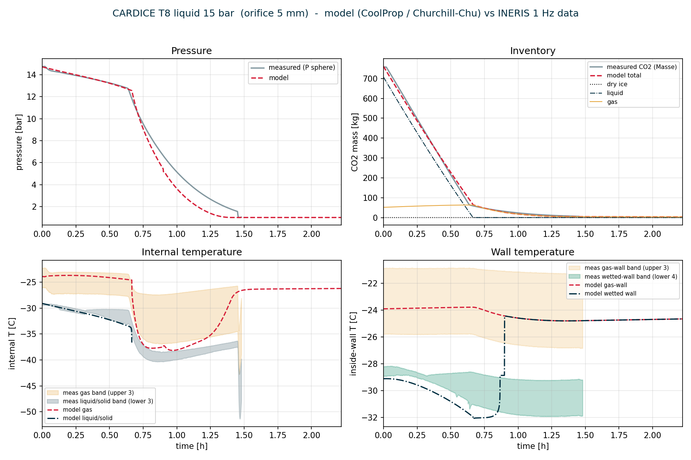

   Test 8 - liquid release, 15 bar.

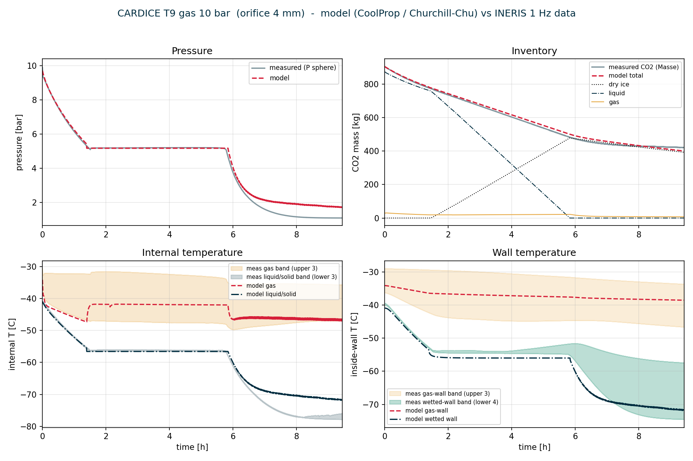

   Test 9 - gas release, 10 bar. The most retained dry ice (:math:`\sim` 392 kg).

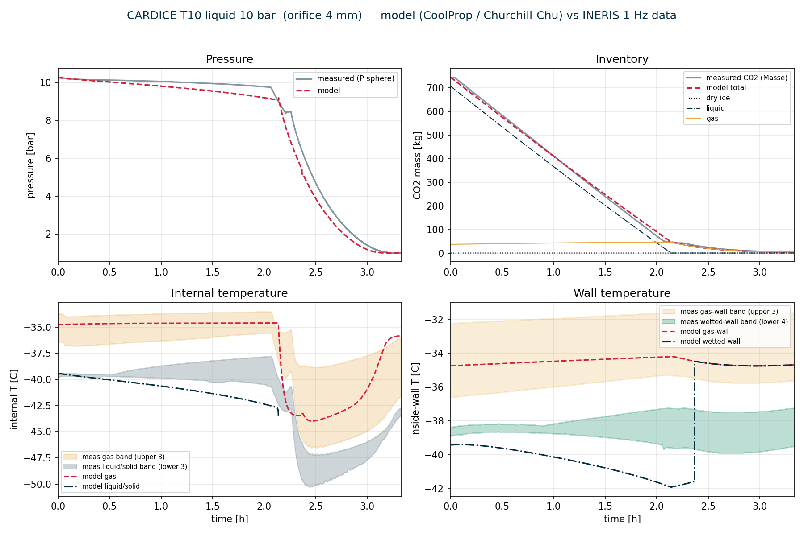

   Test 10 - liquid release, 10 bar. The 385 s acquisition gap at :math:`\sim` 2.2 h is
   merged in the measured trace.

Benchmark against Vessfire (Test 5)
-----------------------------------

Test 5 is the paper's benchmark. :cite:`Vaillant2021` report the measured pressure, mass
flow rate, phase temperatures and wall temperatures against Vessfire
(:numref:`fig-vaillant-t5`). HydDown reproduces the same three-stage behaviour -
gas/liquid blowdown, triple-point plateau, gas/solid sublimation descent - and, like
Vessfire, captures the pressure and rate well while under-predicting the (stratified) gas
temperature.

.. _fig-vaillant-t5:

.. figure:: figures/vaillant_test5.png
   :width: 95%

   Test 5 experimental vs Vessfire results (pressure, mass flow rate, phase temperature,
   wall temperature).

   From :cite:`Vaillant2021`.

Høydalsvik/Munkejord (SINTEF)
=============================

The dense-phase cases are modelled with the same physics (CoolProp + solid table, HEM +
:math:`N`, Churchill-Chu / Cooper walls) with the vertical-cylinder geometry and, for the
riser cases, ``discharge_location`` at the 9 mm riser inlet (:ref:`experimental`). Fluid
and wall temperatures are compared as **upper / lower bands** against the model gas and
liquid/solid (and gas-wall / wetted-wall) nodes.

The no-riser (gas) cases retain a small in-vessel dry-ice bank that the model tracks
closely: :math:`\sim` 8.4 / 7.8 / 8.1 kg modelled for Exp71 / 72 / 75, against a measured
:math:`\sim` 8.4 kg for Exp71 (a clean match on the flagship case). The riser (liquid) cases
drain and empty to essentially zero in-vessel solid, as measured. Across all nine the
model's two zones bracket the measured stratification envelope.

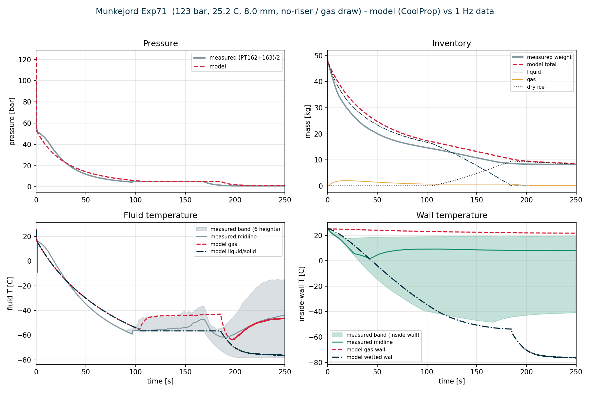

   Exp71 - no-riser (gas) release, 122.6 bar, 8.0 mm. Pressure, inventory (with dry-ice
   breakdown), fluid-temperature band and wall-temperature band vs the model.

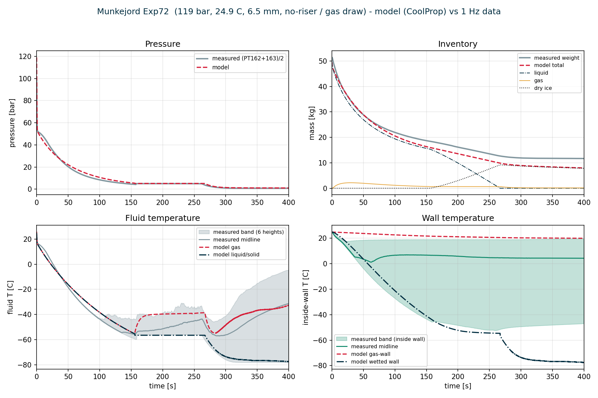

   Exp72 - no-riser (gas) release, 119 bar, 6.5 mm.

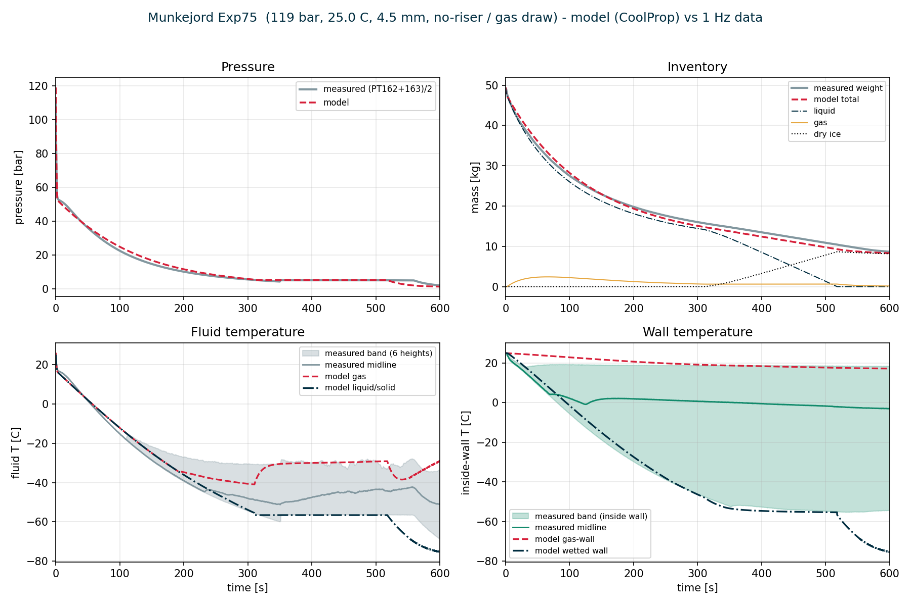

   Exp75 - no-riser (gas) release, 119 bar, 4.5 mm.

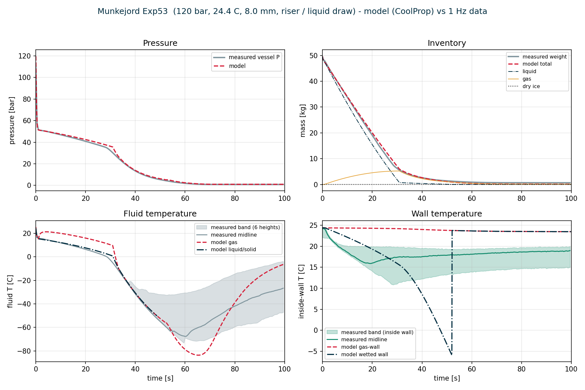

   Exp53 - riser (liquid) release, 119.5 bar, 8.0 mm. The liquid draws through the riser and
   the vessel empties before the triple point.

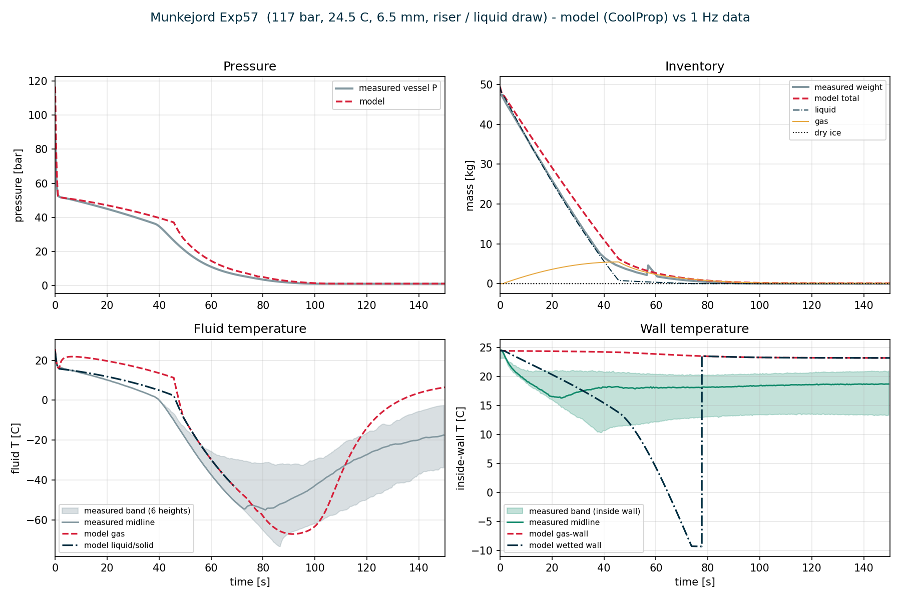

   Exp57 - riser (liquid) release, 116.8 bar, 6.5 mm.

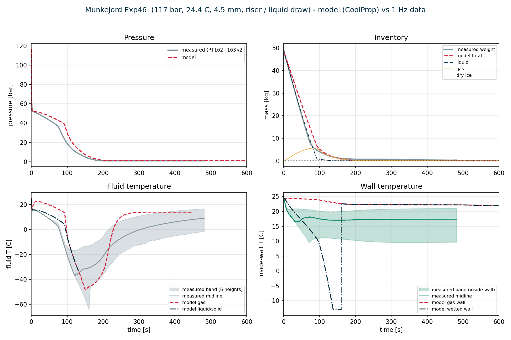

   Exp46 - riser (liquid) release, 116.7 bar, 4.5 mm.

(The remaining riser cases Exp45, Exp52 and Exp56 behave analogously and are generated by
``scripts/validate_munkejord.py``.)

Remaining gaps
==============

These are documented model limitations, not defects:

* **Gas-temperature stratification.** The 0-D gas node runs colder than the measured warm
  top on the gas cases; a single node cannot hold the vertical gradient
  (:ref:`heat_transfer`). Vessfire, a 0-D-gas tool, shows the same :cite:`Vaillant2021`.
* **Dry-ice wall: CARDICE vs Munkejord.** In the gas/solid tail the dry-ice-region wall is
  sublimation-pinned, which matches CARDICE's thick ice bed (walls to :math:`-75\,^{\circ}`\ C)
  but reads too cold for the Munkejord geometry, where the measured bottom wall re-warms
  (thin ice, relatively thicker wall, so lateral 2-D wall conduction feeds heat back into
  the ice-contact metal). A phenomenological lateral-conduction lever to span both is a
  deferred item.
* **Triple-point handover kink.** A :math:`\sim 3\,^{\circ}`\ C gas-temperature kink at the
  CoolProp above-triple :math:`\rightarrow` below-triple vessel hand-over (liquid cases);
  small vs the stratification gap; deferred.
* **Liquid-release heel.** The liquid cases empty to a residual gas heel rather than the
  measured :math:`\sim` 4-5 kg (CARDICE) - a small non-orifice end-effect a steady discharge
  model does not reproduce.

Regression
==========

The base HydDown behaviour is unchanged: all new inputs default off
(``liquid_nonequilibrium: 0``, no ``gas_temperature``), and ``test_all.py`` passes except
pre-existing, unrelated failures (a Tk/plotting environment issue and a modified
``rupture.yml`` example). A dedicated ``src/hyddown/test_co2_release.py`` covers the
CO\ :sub:`2` module.
